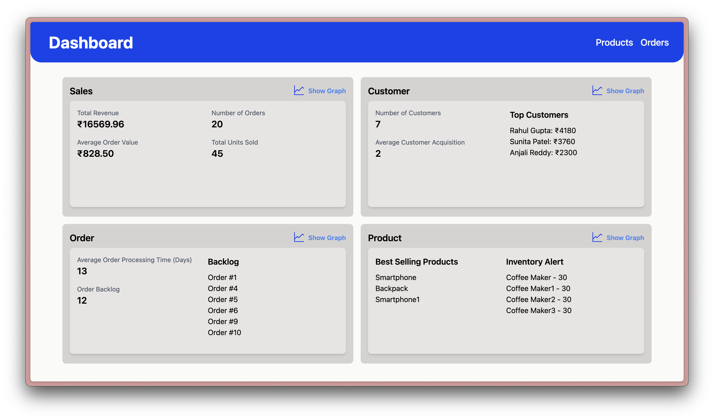
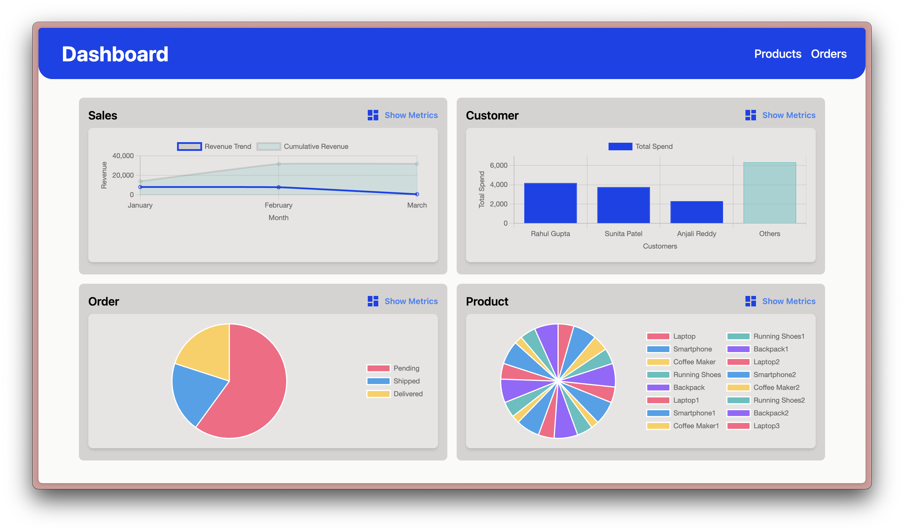
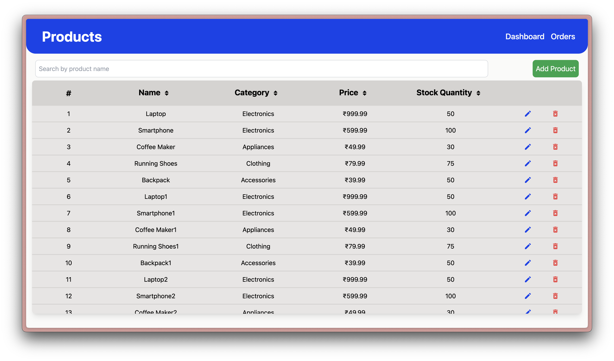
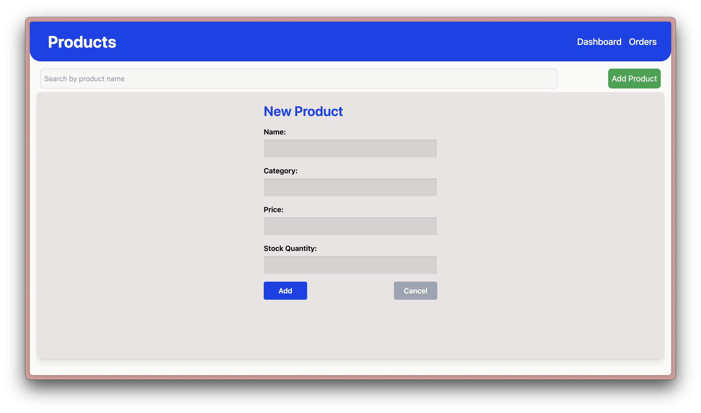
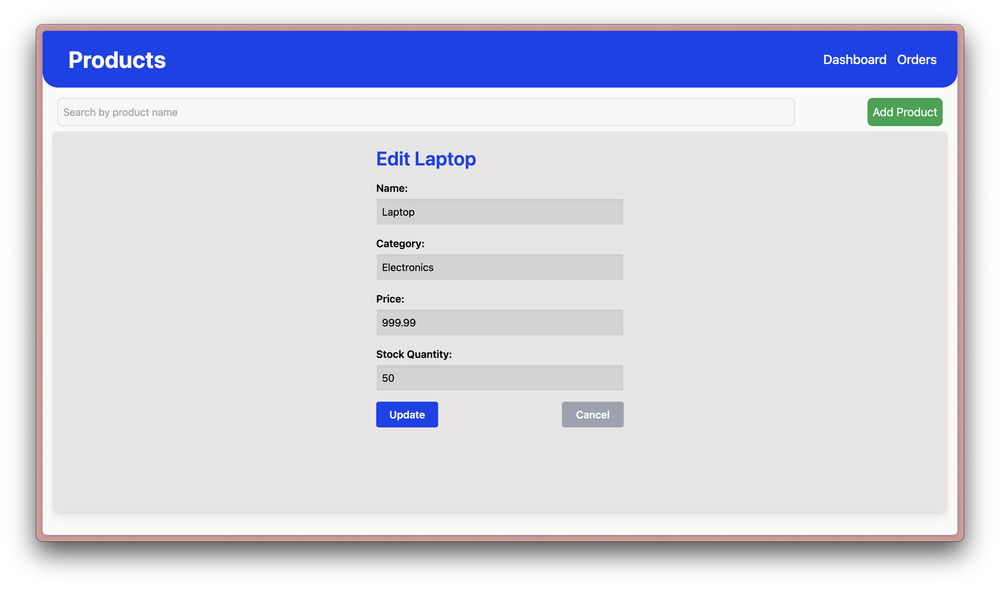
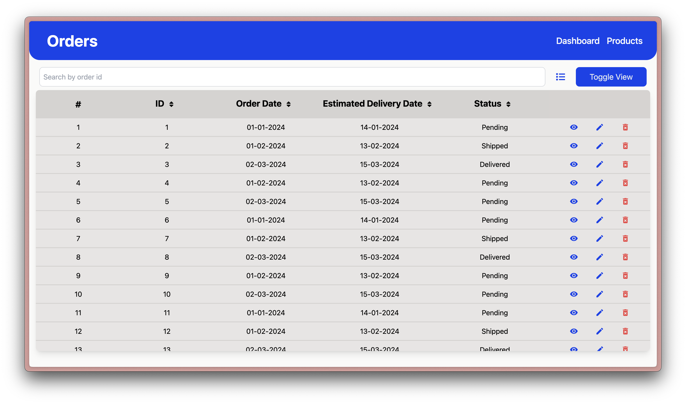
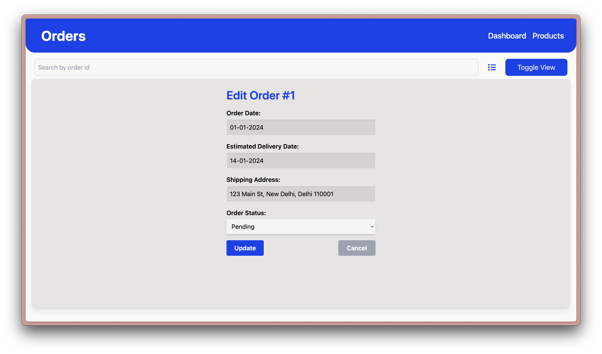
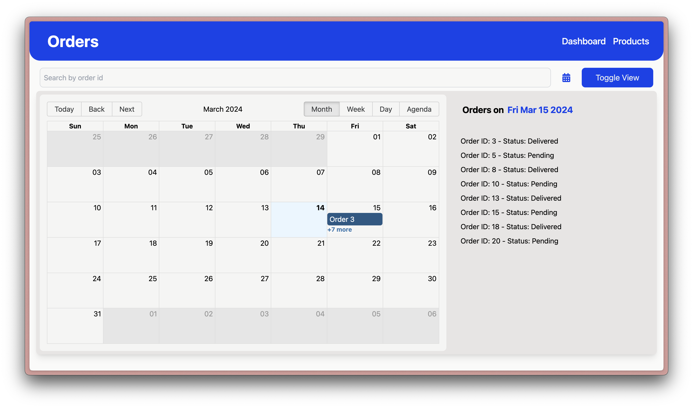

# Enterprise Resource Planning System Frontend

This project is a simplified interface for an ERP (Enterprise Resource Planning) system. It includes pages for Dashboard, Products Management, and Orders Management.

## Features

### Dashboard

-   Display key metrics or features.
-   Quick navigation links to Products and Orders management pages.

### Products Management

-   List and Sort products with details such as name, category, price, and stock quantity.
-   Add, edit, and delete products.
-   Search for a specific product name.

### Orders Management

-   List and Sort orders with details like order ID, customer name, order date, and status.
-   View order and customer details, update order status, and delete orders.
-   Search for a specific product name.
-   Calendar view displaying orders based on their expected delivery dates.
-   Click on a date to view all orders due for delivery that day.

## Technology Stack

-   React for building modular components and managing application state.
-   React Router for navigation between different sections of the ERP system.
-   Chart for creating various types of charts, such as bar charts, line charts, and pie charts, to visualize data in the dashboard or other relevant sections.
-   Moment for handling date-related functionalities, such as parsing, validating, manipulating, and displaying dates and times.
-   React Big Calendar for implementing a flexible and customizable calendar view in the optional Orders Calendar View feature.
-   React Chartjs 2, a React wrapper for Chart.js, providing a set of React components for building charts seamlessly integrated with React applications.
-   React Icons for adding popular icon packs as React components to enhance the user interface and improve user experience.
-   React Loader Spinner for providing customizable loading spinner components to indicate loading states or asynchronous operations within the application.

## Installation and Usage

1.  Clone the repository:

```bash
git clone https://github.com/yourusername/erp-system-frontend.git
```

2.  Navigate to the project directory::

```bash
cd erm
```

3.  Install the dependencies:

```bash
npm install
```

4.  Start the development server:

```bash
npm run dev
```

## Screenshots

### Dashboard

#### Dashboard - Metric View



#### Dashboard - Graph View



### Products Management



#### Products - Add Products



#### Products - Edit Products



### Orders Management



#### Orders - Edit Orders



#### Orders - Calendar View



## Known Bugs

-   Graphs are not responsive
-   The component having search bar and button is not responsive
-   Calendar View is not responsive
